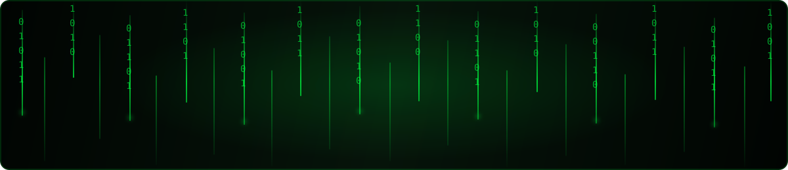

  

<h1 align="center">Bruno Castro</h1>

  <strong>Tecnólogo em Análise e Desenvolvimento de Sistemas.</strong>

  Desenvolvimento Web • Python • Análise de Dados • Inteligência Artificial

  
  

---

## Sobre mim

Sou estudante de **Análise e Desenvolvimento de Sistemas**, com conhecimentos em desenvolvimento web e projetos práticos com Python.

Atualmente estou direcionando meus estudos para **análise de dados** e **inteligência artificial**, ampliando minha base técnica para criar soluções cada vez mais úteis e bem estruturadas.

---

## Tecnologias

### Conhecimentos atuais

  
  
  
  
  
  
  

### Ferramentas

  
  

### Em aprendizado

  
  

---

## GitHub Stats

  
  
  

  
  

---

## Foco atual

| Formação | Desenvolvimento | Estudos |
| --- | --- | --- |
| Tecnólogo em ADS | HTML, CSS e JavaScript | Análise de dados |
| Evolução contínua | Python, SaaS, n8n e Docker | Inteligência artificial |

---

## Projeto em destaque

### Checkmate Gestão

Projeto pessoal voltado para gestão, marketing e desenvolvimento de soluções digitais com foco em produtividade, estratégia e automação.

  

---

## Explore meu perfil

  
  

---

  <strong>Aprendizado contínuo, projetos reais e evolução consistente.</strong>

